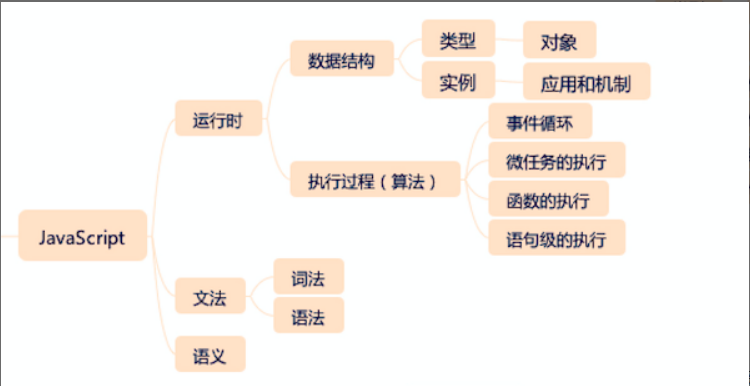
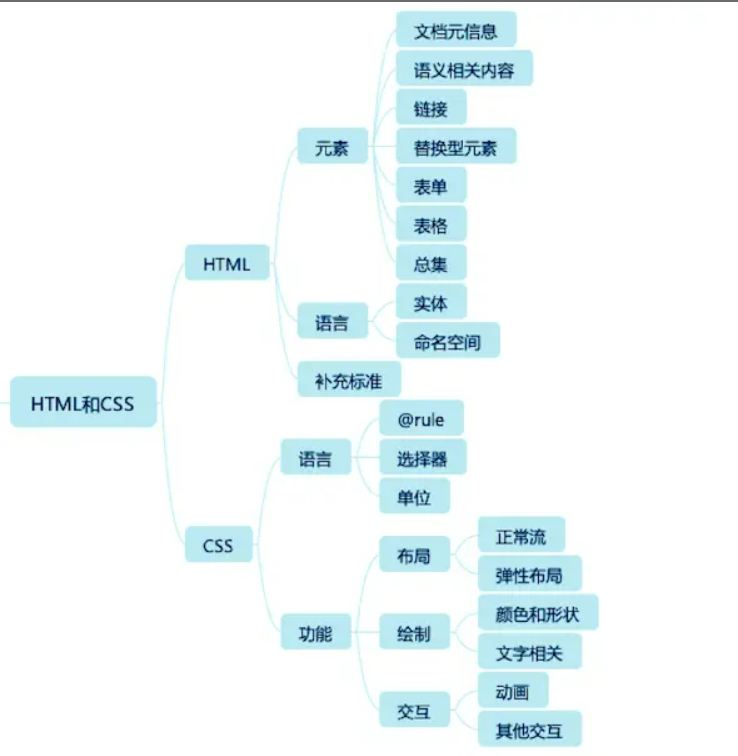
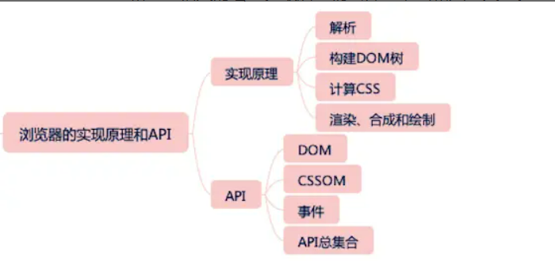
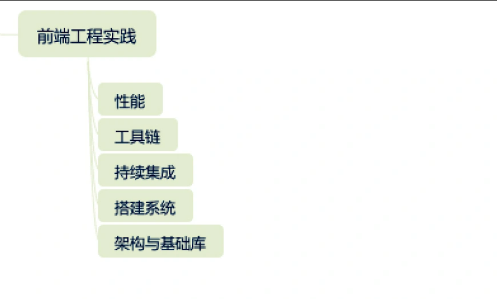

# 重学前端笔记
**JavaScript - 用规定的文法，去表达一定的语义，最终操作运行时**
```
1、文法
    词法
    语法
2、语义
3、运行时：程序 = 数据结构 + 算法 -> 对运行时来说，类型就是数据结构，执行过程就是算法
    类型
    执行过程
```

**知识架构图**
- 
    - 数据结构：
        - 类型：number string boolean symbol undefined null object
        - 实例：List和Record、Set、Completion Record、Reference、Property Descriptor、Lexical Environment和Environment Record、Data Block
- 
-  
- 

## JavaScript模块

### JavaScript类型

#### Undefined
- 表示`未定义`
- 任何变量在赋值之前都是Undefined类型，值为`undefined`
- 因为JavaScript的代码undefined是一个变量而非一个关键字，所以，我们为了避免无意中被篡改，建议使用`viod 0`来获取`undefined`值（undefined被赋值，还是undefined，没有被改变 --- **ES5之前，undefined可以被赋值，现代浏览器已经吧undefined设置为一个non-configurable、non-writable属性的值了**）
- 为什么有的变成规范要求使用`void 0`代替`undefined`？
    - undefined不是一个关键字，避免无意篡改，使用`void 0`

#### Null
- 表示`定义了但是为空`
- Null类型也只有一个值，`null`
- null 是一个关键字

#### Boolean
- true
- false

#### String
- 字符串有最大长度吗？
- String有最大长度`2^53-1`，`但这个最大长度，并不是字符数，而是字符串的UTF16编码`
- 对字符串的操作：charAt、charCodeAt、length等方法针对的都是UTF16编码
- 字符串是永远无法变更的，一旦构造出来，无法使用任何方式改变字符串的内容 -- 字符串字面量的值不可变，可重新赋值

#### Number
- 0.1 + 0.2 不是等于 0.3 吗？为什么JavaScript里面不是这样的？
- 非整数的Number类型无法用`==(或===)`来比较。正确比较浮点数的方法 -- 检查等式两边的差的绝对值是否小于最小精度 -- `console.log(Math.abs(0.1 + 0.2) <= Number.EPSILON)`

#### Symbol
- ES6新加入的Symbol是个什么东西？
- 创建：`var mySymbol = Symbol('my symbol')` -- 可以有字符串描述，字符串描述相同的，symbol值也不同
- 

#### Object
- 为什么给对象添加的方法能用在基本类型上？
    - `.`运算符提供了装箱操作，它会根据基础类型构造一个临时对象，使得我们能在基础类型上调用对应对象的方法
- 对象 -- 属性的集合 -- 数据属性 + 访问器属性

#### 类型转换

##### StringToNumber
- parseInt：在不传入第二个参数的情况下，只支持16进制前缀`0x`，会忽略非数字。任何时候使用，都建议传入第二个参数
- parseFloat：只有十进制的解析规则

##### 装箱转换
- 把基本类型转换为对应的对象。
- 全局的Symbol函数无法使用new来调用 -- 使用一个函数的call方法来强迫产生装箱
    ```
    var symbolObject = (function () { return this }).call(Symbol('a'))

    console.log(typeof symbolObject) // object
    console.log(symbolObject instanceof Symbol) // true

    var symbolObject1 = Object(Symbol('2'))
    ```
- 装箱机制会频繁的产生临时对象，在一些对性能要求比较高的场景下，应该尽量避免对基本类型做装箱转换
- 每一类装箱对象，都有私有的class属性，这些属性可以使用`Object.prototype.toString.call()`获取。该方法可以准确识别对象对应的基本类型的方法，比`instanceOf`更加准确

##### 拆箱转换
- ToPrimitive函数 - 对象到基本类型的转换
- 拆箱转换会尝试调用valueOf和toString来获得拆箱后的基本类型。如果valueof和toString都不存在，抛出typeError
- 规范指出：类型转换的内部实现是通过`ToPrimitive(input [, PreferredType])`方法进行转换的，这个方法的作用就是将input转为一个非对象类型，参数`PreferredType`是可选的，指出了input期望被转成的类型，不传则默认为number；如果`PreferredType`的值是`string`，那就`先执行toString后执行valueOf`，否则`先执行valueOf后执行toString`

### JavaScript对象

#### 一
```js
var o = {
    get a() {
        return 1;
    }
}

console.log(o.a); // 1
```

这里用到的ES6的getter、setter属性，为啥`o.a`？没有写小括号呢？此时的a是一个访问器属性，**每次访问，访问器属性，都会执行get、set方法**。

**JS可以在运行时动态的改变对象**

基于JS的OO，和其他基于类的OO不同之处在于，在于JS可以在运行时修改对象，class based的类只能预先全部定义好，我们并不能在运行时动态修改类。

#### 二

##### 什么是原型？
JavaScript本身就是面向对象的，只是它实现面向对象的方式和主流的流派不太一样。

基于类的编程语言，如：C++、Java。基于原型的编程语言：JavaScript。基于原型和基于类，都能满足基本的复用和抽象，但是适用的场景不太一样。

“基于原型”的变成更提倡程序员去关注一系列对象实例的行为，而后才去关心如何将这些对象，划分到最近使用方式相似的原型对象。而不是将他们分成类。

理解“基于原型”的编程思想，是深入理解JavaScript的关键所在。**原型：一系列对象行为的集合**。原型更强调的是行为。

“基于原型”的面向对象系统通过“复制”的方式来创建新的对象。

原型系统的“赋值操作”有两种实现思路：
    1、一个是，并不是真正的复制一个原型对象，而是使得新对象`持有一个原型的引用`。**JavaScript采用了这一种思路**

    2、另一个是切实的复制对象，从此两个对象再无关联。

##### JavaScript原型
如果抛开JavaScript用于模拟Java类的复杂语法设施，如`new， Object，Function，函数的prototype属性等`，原型系统可以这样概括：
    1、如果所有对象都有私有字段`[[prototype]]`，就是对象的原型。

    2、读一个属性，如果对象本身没有，则会继续访问对象的原型，直到原型为空或者找到为止。

ES6提供的直接访问操纵原型的方法：
    Object.create() 根据指定的原型创建新对象，原型可以是null
    Object.getPrototypeOf() 获得一个对象的原型
    Object.setPrototypeOf() 设置一个对象的原型

##### 早期版本中的类和原型
早期版本的JS中，`类`是一个私有属性`[[class]]`，Number String Date 等都指定了`[[class]]`属性，以表示他们的类。唯一可以访问`[[class]]`属性的方法是`Object.prototype.toString`

ES5开始，`[[class]]`属性被`Symbol.toStringTag`代替，我们甚至可以使用`Symbol.toStringTag`来自定义`Object.prototype.toString`的行为。
```js
        // 重新定义toString
        let o = {
            [Symbol.toStringTag]: 'test!!!'
        }

        console.log(o + ''); // [object test!!!]
```

**new操作符**

new运算符接受一个`构造器`和`一组调用参数`，实际上做了几件事:

以构造器的prototype属性为原型，创建新对象。

将this和调用参数传给构造器，执行。

如果构造器返回的是对象，则返回。否则返回第一步创建的对象。

##### ES6中的类

数据成员最好写在构造函数中，不建议在constructor之外定义属性

```js
class Rectangle {
    constructor(height, width) {
        this.height = height;
        this.width = width;
    }

    // Getter
    get area() {
        return this.calcArea();
    }

    // Method
    calcArea() {
        return this.height * this.width;
    }
}

let rect1 = new Rectangle(12, 30);
        
console.log(rect1.area); // getter属性，不用加括号

```

类的所有属性和方法，都是定义在类的prototype上的

```js
class Parent {
    constructor() {}
    sayName() {}
    getName() {}
}

// 等价于

Parent.prototype = {
    constructor() {},
    sayName() {},
    getName() {}
}
```

#### 三

##### JS中的对象分类

- 宿主对象：由JavaScript宿主环境提供的对象，他们的行为完全由宿主环境决定
- 内置对象：由JavaScript语言提供的对象
  - 固有对象：由标准规定，随着JavaScript运行时创建而自动创建的对象实例
  - 原生对象：可以由用户通过Array、RegExp等内置构造器或者特殊的语法创建的对象
  - 普通对象：由{}语法、Object.create构造器或者class关键字定义类创建的对象，它能够被原型继承。

##### 函数对象和构造器对象

**函数对象**：具有`[[call]]`私有字段的对象。任何宿主只要提供了“具有`[[call]]`私有字段的对象”，就可以被JavaScript函数调用语法支持。
    `[[call]]`私有字段必须是一个引擎中定义的函数，需要接受this值和调用参数，并且会产生域的切换。

**构造器对象**：具有`[[construct]]`私有字段的对象。

对于宿主环境来说，他们实现[[call]]（作为函数被调用）和[[construct]]（作为构造器被调用）不总是一致的。比如内置对象Date在作为构造器调用时产生新的对象，作为函数调用时，则产生字符串。

构造器函数会产生对象，函数调用不一定返回对象，可能返回的是其他的值

```js
console.log(new Date);

console.log(Date());

console.log() 会调用toString方法，

typeof Date() // string
typeof new Date() // object
```


[[construct]]的执行过程如下:
    以Object.prototype为原型创建一个新对象;
    以新对象为this,执行函数的 [[call]];
    如果[[call]]的 返回值是对象,那么,返回这个对象,否则返回第一步创建的新对象

利用构造器来实现私有:
    构造器返回了一个新的对象,那么new创建的新对象就变成一个构造函数之外完全无法访问的对象,这一定程度上可以实现"私有"

```js
function Fn() {

    this.a = 'aaa';

    return {
        getValue: () => this.a;
    }
}
// 构造函数返回了一个对象
let fn1 = new Fn();

```


### Javascript的执行
早期的JavaScript没有执行异步代码的能力.

ES5 之后, JavaScript引入了Promise ,JavaScript引擎本身也可以发起任务了.

我们把宿主发起的任务称之为宏观任务,JavaScript引擎发起的任务称之为微观任务.

#### 一

**Promise**

**async/await**

`generator/iterator`常常被跟异步一起来讲,但是它们并非是异步代码,只是在缺少async/await的时候,一些框架使用这样的特性来模拟async/await.,他们最原始的作用是`迭代`.

```js
    // 实现一个红绿灯
    function sleep(duration) {
        return new Promise(function(resolve, reject) {
            setTimeout(resolve, duration);
        })
    }

    async function changeColor(duration, color) {
        document.getElementById('deng').style.background = color;
        await sleep(duration);
    }

    async function main() {
        while(true) {
            await changeColor(3000, 'green');
            await changeColor(2000, 'yellow');
            await changeColor(1000, 'red');
        }
    }

    main();
```

#### 二 闭包和执行上下文


#### 三


## HTML和CSS

### HTML

#### 元信息类标签
HTML用于描述文档自身的一类标签,一般不会在页面被显示出来.

元信息大多数情况下是给浏览器,搜索引擎等机器阅读的,有时候这些信息会在页面之外显示给用户,有时候则不会.

##### head标签
作为容器使用.

必须是html标签的第一个标签,它的内容必须包含一个title.(当文档作为iframe标签时,可以没有title)

##### title标签

##### base标签
是一个历史遗留标签,作用是给页面上所有的URL相对地址提供一个基础,base标签最多只有一个,它改变全局的链接地址,不太建议使用

##### meta标签
- 通用的元信息表示标签
- head中可以有多个meta标签
- 一般的meta标签由name和content两个属性来定义:name表示元信息的名称,content表示元信息的值
  ```html
    <meta name="application-name" content="lsForms"></meta>
  ```

**具有charset属性的meta标签**

能规定网页打开的格式,对于非http链接形式打开的文件(如file协议打开一个html文件),这个标签就很重要.

```html
<!-- 具有charset属性的meta 描述了html文档的编码形式-->
<meta charset="utf-8">
```

**具有http-equiv属性的meta标签**
```html
<!-- 相当于添加了 content-type 这个http头, 并且指定了编码方式 -->
<meta http-equiv="content-type" content="text/html; charset=UTF-8">
```

- content-type
- content-language: 指定内容的语言
- default-style: 指定默认样式表
- refresh: 刷新
- set-cookie: 模拟http头的 set-cookie,设置cookie
- x-ua-compatible: 模拟http头的x-ua-compatible, 声明ua兼容性
- content-security-policy: 模拟http头的content-security-policy,声明内容安全策略

**name为viewport的meta**
移动开发的标准事实.
```html
<meta name="viewport" content="width=500, initial-scale=1">

<!-- 一个标准的meta标签 -->
<meta name="viewport" content="width=device-width, initial-scale=1, minmum-scale=1, maxmun-scale=1, user-scalable=no">
```
- content可以指定以下属性:
  - width: 页面宽度,可以是数值,也可以是`device-width`设备宽度
  - height: 页面高度,可以是具体的数值,也可以是`device-height`设备高度
  - initial-scale: 初始缩放比例
  - minimun-scale: 最小缩放比例
  - maxnum-scale: 最大缩放比例
  - user-scalable: 是否允许用户缩放(移动端一般都会禁止,即: user-scalable=no)

#### 语义化标签
- 增强了可读性
- 适合机器阅读:适合搜索引擎检索,有利于SEO;支持读屏软件,根据文章自动生成目录.

em表示重音

section标签:由语义的div标签,改变了和h1 - h6的语义,section的嵌套会使得h1-h6下降一级.section和h1足以满足形成文档的树形结构.

### CSS
CSS 顶层样式表由两种规则组成的规则列表构成:
    一种被称为at-rule,就是at规则
    另一种是普通规则

#### at-rule
**at-rule**:由一个关键字@和后续的一个区块组成.如果没有区块,就用分号结尾.

- @charset
- @import
- @media
- @page
- @counter-style
- @keysframe
- @fontface
- @supports
- @namespace

##### @charset
提示CSS文件使用的字符编码方式,它如果被使用,必须出现在最前面.

```css
@charset "utf-8";
```
##### @import
用于引入一个CSS文件,除了@charset不会被引入,@import可以引入另一个文件的所有内容.

```css
@import "mystyle.css";
```
##### @media
媒体查询的使用规则

```css
/* 这是 打印 样式,覆盖浏览器自带的样式 */
@media print {
    body {
        font-size: 18px;
    }
}
```
##### @page
// TODO
page用于分页媒体访问网页时的表现设置,页面是一种特殊的盒模型结构,除了页面本身,还可以设置它周围的盒.
```css
@page {
    size: 8.5in 11in;
    margin: 10%;

    @top-left {
        content: "Hamlet"
    }

    @top-right {
        content: "Page" counter(page);
    }
}
```
##### @counter-style
产生一种数据,用于定义列表项的表现,修改`ul`中每一项前面的图标.

```css
@counter-style trangle {
    system: cyclic;
    symbols: ❤;
    suffix: " ";
}
```
##### @keyframes
定义动画关键帧

```css
@keyframes my-animation {
    from {
        left: 0;
        top: 0
    }

    to {
        left: 100px;
        top: 100px;
    }
}
```

##### @fontface
用于定义一种字体,iconfont就是利用这个特性来实现的.
```css
@font-face {
    font-family: Gentium;
    src: url(http://example.com);
}

p {
    font-family: Gentium;
}
```
##### @support
检查环境的特性,它与media比较类似.

##### @namespace
用于跟XML命名空间配合的一个规则,表示内部的CSS选择器全都带上特定的命名空间.

##### @biewport
用于设置视口的一些特性,不过兼容性目前不是很好,多数时候被HTML的meta代替.


#### 普通规则

选择器 + 声明语句(属性 + 值)

**属性**: 由中划线,下划线,字母等组成的标识符,CSS还支持使用反斜杆转义.属性不允许使用连续的两个中划线开头,这样的属性会被识别为css变量.

```css
:root {
    --main-color: #ff0000;
    --accent-color: #ff00ff;
}

.test-box {
    color: var(--main-color);
}
```

- CSS 函数:
  - calc(): 可以不同单位混合运算
  - max()
  - min()
  - clamp(): 给一个值限定一个范围,超出范围外则使用范围的最大值或者最小值.
    - 接收三个用逗号分隔的表达式作为参数,按`最小值` `首选值` `最大值`的顺序排列
    ```css
        .box {
            font-size: clamp(20px, 18px, 40px);
            width: clamp(100px, 100%, 200px); /* 100% 可能会出现比100px小?比200px大?的情况 */
        }
    ``` 
  - toggle(): 在规则选中多与一个元素时,他会在几个值之间来回切换
    ```css
        ul {
            <!-- 这个暂时没有生效 -->
            list-style-type: toggle(circle, square);
        }
    ```
  - attr(): 允许CSS接受属性值的控制

貌似除了clac(), 其他的还没实现.


#### 选择器

##### 属性选择器
- [attr]
  - 只要有这个属性,就可以被选中
- [attr=val]
  - 精确匹配,检查一个元素属性是否是val
- [attr~=val]
  - 一个元素的某个属性的值有很多个,这些值只要有一个匹配上了val就行,而val里面如果有空格或者val为空格,则永远无法匹配上
  - 好像应该说:带有以attr命名的属性的元素,并且该属性值是一个以空格作为分隔的值列表,其中至少一个值匹配val
    ```html
        <div name="1 2" age="2" link="3">测试一下属性选择器</div>

        // 选中
        div[name~="1"] {
            color: #ff0000;
        }

        // 没有选中
        div[name~="1 2"] {
            color: #ff0000;
        }
    ```
- [attr|=val]
  - 开头匹配. 检查一个元素的值是否是以val开头,它跟精确匹配的区别在于属性只要是以val开头即可.
    - 典型的应用场景就是用来匹配语言简写代码(zh-CN zh-TW, 可以用zh作为value)
    ```html
        div[value|="value"] {
            background-color: #172dea;
        }

        <div name="1 2" value="value-2" age="2" link="3">测试一下属性选择器</div>
    ```
- [attr^=val]
##### 伪类选择器
以冒号开头的选择器,有普通型和函数型两种.

**树结构关系伪类**
- :root 表示树的根元素,在选择器是针对完整的HTML文档的情况下,html标签就是跟元素,但是随着`scoped css` 和 `shadow root`等场景的出现, 选择器可以针对某一子树来选择,就可能会用到:root伪类了
- :empty 没有子节点的元素,这里有个例外就是子节点为空白文本的情况
- :nth-child
  - :nth-child(even)  选中偶数节点
  - :nth-child(4n - 1) 选中第三个\第七个这样的节点
  - :nth-child(3n+1 of li.important)  选中第一个 第四个 第七个 li.important(只有li.important会被计数)
- :nth-last-child: 相比nth-child,就是从后往前开始数
- of type 系列,是一个变形的语法糖`S:nth-of-type(An+B)`相当于`nth-child(An+B of S)`

**链接与行为伪类选择器**
- :any-link
- :link 访问过的链接
- :visited
- :hover
- :active
- :focus
- :target 用于选中浏览器中URL的hash部分所指的元素

**逻辑伪类选择器**
-:not()  
    ```html
        <style>
            div:not(:hover) {
                background-color: #dea;
            }
        </style>
        <div name="1 2" age="2" link="3">测试一下属性选择器</div>
        <div>ceshi yaaa</div>
    ```

## 浏览器实现原理API

## 前端综合应用